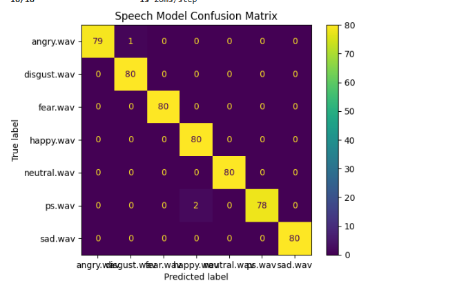
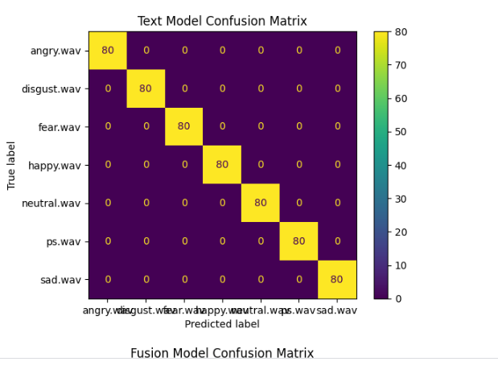
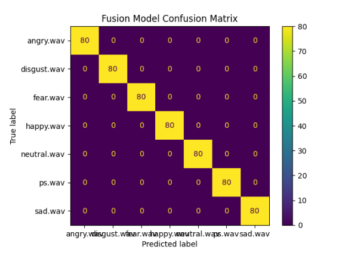

# 🎯 Multimodal Emotion Recognition using TESS Dataset

This project focuses on recognizing human emotions from speech and text
using deep learning and multimodal fusion techniques.


## 📌 Project Overview

Emotion recognition plays a vital role in human-computer interaction.
This project compares:

- Speech-only model
- Text-only model
- Multimodal Fusion model

to analyze performance improvements using multimodal learning.


## 📊 Dataset

**Toronto Emotional Speech Set (TESS)**

- Contains emotional speech samples
- Emotions: Angry, Disgust, Fear, Happy, Neutral, Sad, Pleasant Surprise
- Recorded by professional actresses


## 🧠 Models Implemented

### 🔹 Speech Model
- Feature: MFCC
- Architecture: BiLSTM + Dense
- Input: Audio (.wav)

### 🔹 Text Model
- Feature: Synthetic Text Metadata
- Architecture: Embedding + BiLSTM
- Input: Generated Text

### 🔹 Fusion Model
- Feature: Speech + Text
- Architecture: Late Fusion Neural Network


## 📁 Project Structure

```text
multimodal-emotion-recognition/
│
├── notebook/            # Kaggle execution notebook .ipynb
├── project/             # Training and testing scripts
├── saved_models/        # Trained .h5 models
├── Results/             # Accuracy and evaluation plots
├── assets/              # Images for README
├── README.md
└── requirements.txt


## 🧪 Experiments and Implementation

All experiments were conducted on Kaggle platform.
The complete training process, evaluation metrics,
and visualizations are available in the notebook folder.


## 📈 Results

### 🔹 Model Accuracy Comparison

| Model  | Accuracy |
|--------|----------|
| Speech | 0.99     |
| Text   | 1.00     |
| Fusion | 1.00     |


### 🔹 Confusion Matrices

#### Speech Model


#### Text Model


#### Fusion Model



## 🚀 How to Run the Project

### 1️⃣ Install Dependencies

```bash
pip install -r requirements.txt


2.Train Model

python project/models/speech_pipeline/train.py
python project/models/text_pipeline/train.py
python project/models/fusion_pipeline/train.py

3.Test Model

python project/models/speech_pipeline/test.py
python project/models/text_pipeline/test.py
python project/models/fusion_pipeline/test.py


⚠️ Limitations

. Real transcripts are not available in TESS dataset

. Text modality is generated synthetically

. Dataset size is limited


🌟 Future Work

. Use real speech-to-text transcripts

. Apply transformer-based models

. Expand dataset

👨‍💻 Author

Sammi Kumar
B.Tech | AI & Data Science


